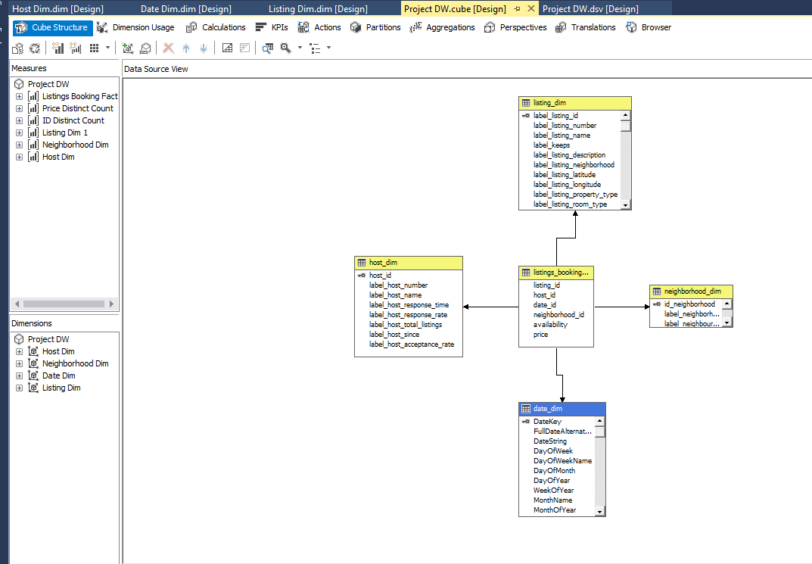

# Athens-Airbnb-Data-Warehouse
Engineered a data warehouse in SQL Server using Airbnb data for the city of Athens, constructing a robust pipeline to extract, clean, and transform data with a star schema for efficient querying. Presented insights through Power BI visualization.

**Objective:**
This project aims to demonstrate the end-to-end process of transforming raw Airbnb data into a structured data warehouse and creating insightful visualizations using Power BI.

**Tools Used:**
- SQL Server
- MS Visual Studio (ETL Pipeline)
- Power BI

## Project Overview:
1. **Data Acquisition:** 
   Obtained raw Airbnb data from [http://insideairbnb.com/] website. We focused only in the city of Athens and we downloaded three files in csv that included reservations from 27-03-23 until 23-03-24 as below:
   
    **Calendar data** file that stores daily reservations on airbnb platform (4.154.445 records)

    **Listings data** file that stores information about the appartments available for rent on airbnb platform (11.382 records)

    **Neighbourhoods geojson** file that stores topographic information about Athens neightbourhoods (longtitude, latitude exc)

2. **Data Transformation in SQL Server:** By applying the literature (Kimball) concerning the steps for creating a Data Warehouse (DW Design Steps), on the dataset the following emerged:

      **Step 1: Choose the process to model:** Reservations for properties on the Airbnb platform will be modeled for the period from 27-03-23 to 27-03-24.

      **Step 2: Choose the granularity of the process:** Reservations per day, per property, per host, per region, and combinations thereof.

      **Step 3: Choose the dimensions:** Date, Listing (property), host (person who owns the property), neighborhood (property's neighborhood).

      **Step 4: Choose the measures:** Listing count, Host count, Average Listing Price, and some calculated metrics that will be presented in more detail later in the work, specifically during the                 analysis of the cube.

Based on the above steps, in creating the database on the SQL server, we arrived at the following:A database named ProjectDW, four dimension tables as follows: Date Dimension named date_dim, Listing Dimension named listing dim, Host Dimension named host dim, Neighborhood Dimension named neighborhood dim. Finally we came up with a fact table named listings booking fact. The whole process resulted a star schema data warehouse as below:



   **Date Dimension:**
    We run the code that generate the table for dates and loads date data through a looping process.

```sql CREATE TABLE [dbo].[DimDate](
       [DateKey] [int] NOT NULL,
       [FullDateAlternateKey] [date] NOT NULL,
       [DateString] [varchar](10) NULL, /*date evala*/
       [DayOfWeek] [tinyint] NOT NULL,
       [DayOfWeekName] [nvarchar](10) NOT NULL,
       [DayOfMonth] [tinyint] NOT NULL,
       [DayOfYear] [smallint] NOT NULL,
       [WeekOfYear] [tinyint] NOT NULL,
       [MonthName] [nvarchar](10) NOT NULL,
       [MonthOfYear] [tinyint] NOT NULL,
       [CalendarQuarter] [tinyint] NOT NULL,
       [CalendarYear] [smallint] NOT NULL,
       [IsWeekend] [bit] NOT NULL,
       [IsLeapYear] [bit] NOT NULL,
    CONSTRAINT [PK_DimDate] PRIMARY KEY CLUSTERED
      ([DateKey] ASC
      )WITH (PAD_INDEX = OFF, STATISTICS_NORECOMPUTE = OFF, IGNORE_DUP_KEY = OFF, ALLOW_ROW_LOCKS = ON, ALLOW_PAGE_LOCKS = ON) ON [PRIMARY]
      ) ON [PRIMARY]
      GO
      SET ANSI_PADDING OFF
      GO
      ALTER TABLE [dbo].[DimDate] ADD  CONSTRAINT [DF_DimDate_IsWeekend]  DEFAULT ((0)) FOR [IsWeekend]
      GO
      ALTER TABLE [dbo].[DimDate] ADD  CONSTRAINT [DF_DimDate_IsLeapYear]  DEFAULT ((0)) FOR [IsLeapYear]   
      GO

```
   *We used only dates within the loop from 1-1-2007 to 31-12-2025. The reason for going back so far, despite the fact table covering the years 2023 and 2024, is that we identified the attribute       "host since" (indicating when the host became a member of Airbnb) in the host dimension with a minimum value of 2008. Therefore, in a potential connection between the host dimension and the date    dimension, the relevant date should exist.*

   **Flags and Slowly Changing Dimensions:** 
    Based on the operational scenario, the initial scrape took place on 27-03-23, gathering reservations for listings over a year. However, subsequent scrapes might cause changes in t"availability"    attribute. This change could occur if a booking was made for the same date and listing, altering the attribute from 1 (availability = true) to 0 (availability = false). How we handle such a         scenario? It was identified as a *slowly changing dimension problem*. Initially, the thought was to simply overwrite the availability attribute. Yet, it became evident that this approach would       result in the loss of valuable information regarding the availability changes for each property. Therefore, a decision was made to create two new columns in the pseudo table: "timestamp" and       "flag". The "timestamp" column recorded the date of entry for the records, while the "flag" column indicated active records, marking the most recent changes (flagged with 1 based on the             timestamp). Consequently, in future scenarios where it's necessary to track the evolution of availability over time, considering scrape dates, this information would be stored in the calendar       dimension.

```sql update calendar_dim
set flag = 0 where
calendar_id in (
select calendar_dim.calendar_id from (
SELECT	listing_id, booking_date, calendar_id, flag, timestamp_id,
        ROW_NUMBER() OVER (
                PARTITION BY	listing_id,
                                booking_date
                      ORDER BY		listing_id
            ) AS ROW_NUM
FROM		calendar_dim
) d, calendar_dim
where d.ROW_NUM>1 and calendar_dim.listing_id=d.listing_id and calendar_dim.booking_date=d.booking_date)

update calendar_dim
set flag = 1 
where calendar_id in (select calendar_dim.calendar_id from calendar_dim
join (select max(calendar_dim.timestamp_id) as maxtimestamp from calendar_dim) tbl1
on tbl1.maxtimestamp=calendar_dim.timestamp_id)

```

**Feature Creation:** 
We noticed that the "amenities" attribute (text) contained all amenities in concatenated text format. We found it beneficial to select the most commonly occurring amenities across all listings and then proceed to create separate columns (attributes) for each listing. These new columns would take values of 0 (not included) or 1 (included) for each respective amenity. This approach would make it easier to draw conclusions regarding the sets of amenities (metro tation nearby included) across all or for each listing. The code is presented below:
```sql SELECT        host_name, try_convert(decimal(30, 0), id) AS id, name, description, keeps_id, try_convert(int, 
                         (CASE WHEN [host_response_time] LIKE '%within an hour%' THEN 1 WHEN [host_response_time] LIKE '%within a few hours%' THEN 2 WHEN [host_response_time] LIKE '%within a day%' THEN 3 WHEN [host_response_time] LIKE
                          '%within a few days or more%' THEN 4 ELSE 0 END)) AS host_response_time, try_convert(int, (CASE WHEN host_response_rate LIKE '%N/A%' THEN 0 ELSE (REPLACE([host_response_rate], '%', '')) END)) 
                         AS host_response_rate, try_convert(int, (CASE WHEN host_acceptance_rate LIKE '%N/A%' THEN 0 ELSE (REPLACE([host_acceptance_rate], '%', '')) END)) AS host_acceptance_rate, try_convert(int, host_total_listings_count) 
                         AS host_total_listings, neighbourhood_cleansed AS neighborhood, latitude, longitude, property_type, room_type, try_convert(int, accommodates) AS accomodates, try_convert(int, bedrooms) AS bedrooms, try_convert(int, 
                         LEFT(bathrooms_text, 1)) AS bathrooms, try_convert(int, beds) AS beds, try_convert(varchar(max), amenities) AS amenities, try_convert(int, minimum_nights) AS min_nights, try_convert(int, maximum_nights) AS max_nights, 
                         try_convert(decimal(18, 0), REPLACE(review_scores_value, '.', '')) / 100 AS review_score, try_convert(int, (CASE WHEN [instant_bookable] = 'f' THEN 0 ELSE 1 END)) AS instant_bookable, [Copy of host_since] AS host_since, 
                         [Copy of last_scraped] AS scrape_date, (CASE WHEN [description] LIKE '%metro%' OR
                         [name] LIKE '%metro%' THEN 1 ELSE 0 END) AS near_metro, (CASE WHEN [amenities] LIKE '%refrigerator%' OR
                         [amenities] LIKE '%fridge%' OR
                         [description] LIKE '%refrigerator%' OR
                         [description] LIKE '%fridge%' THEN 1 ELSE 0 END) AS refrigerator, (CASE WHEN [amenities] LIKE '%oven%' OR
                         [amenities] LIKE '%stove%' OR
                         [description] LIKE '%oven%' OR
                         [description] LIKE '%stove%' OR
                         [amenities] LIKE '%kitchen%' OR
                         [description] LIKE '%kitchen%' THEN 1 ELSE 0 END) AS cooking, (CASE WHEN [amenities] LIKE '%shampoo%' OR
                         [amenities] LIKE '%body soap%' OR
                         [description] LIKE '%shampoo%' OR
                         [description] LIKE '%body soap%' THEN 1 ELSE 0 END) AS cosmetics, (CASE WHEN [amenities] LIKE '%HDTV%' OR
                         [description] LIKE '%HDTV%' THEN 1 ELSE 0 END) AS HDTV, (CASE WHEN [amenities] LIKE '%Amazon%' OR
                         [amenities] LIKE '%Netflix%' OR
                         [description] LIKE '%Amazon%' OR
                         [description] LIKE '%Netflix%' THEN 1 ELSE 0 END) AS Cable_TV, (CASE WHEN [amenities] LIKE '%garage%' OR
                         [amenities] LIKE '%parking%' OR
                         [description] LIKE '%garage%' OR
                         [description] LIKE '%parking%' THEN 1 ELSE 0 END) AS parking, (CASE WHEN [amenities] LIKE '%Baby%' OR
                         [description] LIKE '%Baby%' THEN 1 ELSE 0 END) AS Baby, (CASE WHEN [amenities] LIKE '%Backyard%' OR
                         [description] LIKE '%Backyard%' THEN 1 ELSE 0 END) AS Backyard, (CASE WHEN [amenities] LIKE '%iron%' OR
                         [description] LIKE '%iron%' THEN 1 ELSE 0 END) AS Iron, (CASE WHEN [amenities] LIKE '%game console%' OR
                         [description] LIKE '%game console%' THEN 1 ELSE 0 END) AS game_console, (CASE WHEN [amenities] LIKE '%bike%' OR
                         [description] LIKE '%bike%' THEN 1 ELSE 0 END) AS bike, (CASE WHEN [amenities] LIKE '%BBQ%' OR
                         [description] LIKE '%BBQ%' THEN 1 ELSE 0 END) AS BBQ, (CASE WHEN [amenities] LIKE '%toy%' OR
                         [description] LIKE '%toy%' THEN 1 ELSE 0 END) AS Toys, (CASE WHEN [amenities] LIKE '%wifi%' OR
                         [description] LIKE '%wifi%' THEN 1 ELSE 0 END) AS Wifi, (CASE WHEN [amenities] LIKE '%dryer%' OR
                         [description] LIKE '%dryer%' THEN 1 ELSE 0 END) AS Dryer, (CASE WHEN [amenities] LIKE '%hangers%' OR
                         [description] LIKE '%hangers%' THEN 1 ELSE 0 END) AS Hangers, (CASE WHEN [amenities] LIKE '%heat%' OR
                         [description] LIKE '%heat%' THEN 1 ELSE 0 END) AS Heating, (CASE WHEN [amenities] LIKE '%pets allowed%' OR
                         [description] LIKE '%pets allowed%' THEN 1 ELSE 0 END) AS Pet_allowed, (CASE WHEN [amenities] LIKE '%balcony%' OR
                         [description] LIKE '%balcony%' THEN 1 ELSE 0 END) AS Balcony, (CASE WHEN [amenities] LIKE '%fireplace%' OR
                         [description] LIKE '%fireplace%' THEN 1 ELSE 0 END) AS Fireplace
FROM            dbo.Listing_Staging_Final
```

4. **ETL Pipeline and OLAP Cube Creation in MS Visual Studio:**
   Developed an ETL pipeline to extract, transform, and load data into a star schema data warehouse as below:
   

   


6. **Visualization in Power BI:**
   - Imported the transformed data into Power BI.
   - Created interactive visualizations and insightful


