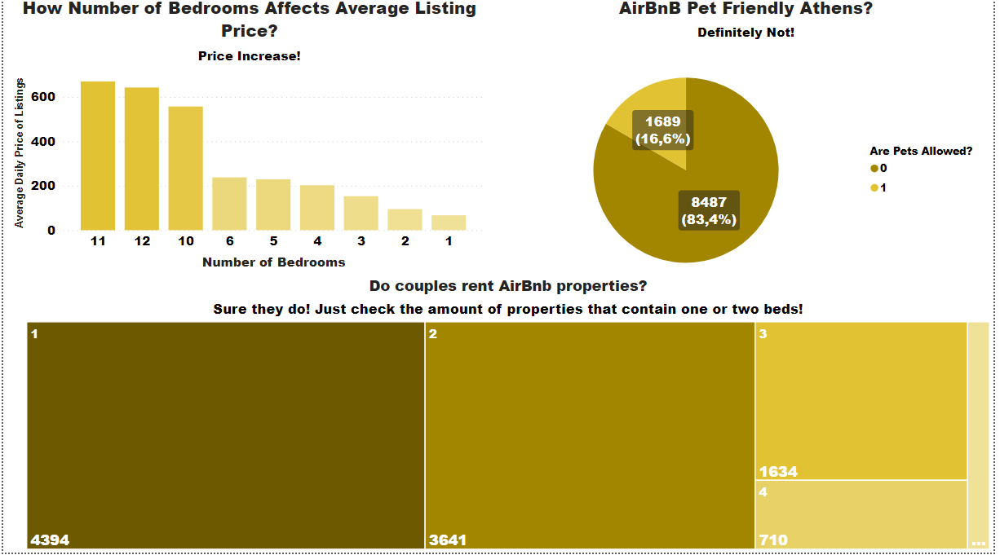

## Athens Airbnb Data Warehouse & Insights: SQL Transformation, ETL Pipeline and Power BI Visualization:
I engineered a data warehouse in SQL Server utilizing Airbnb data for Athens, creating a robust pipeline to extract, clean, and transform data into a star schema for efficient querying. Additionally, I designed and implemented an OLAP cube to further analyze and aggregate the data, facilitating multidimensional analysis. These insights were then presented through Power BI visualizations, providing comprehensive analytics and actionable information.

## Objective:
This project aims to showcase the complete transformation process, starting from raw Airbnb data, culminating in a structured data warehouse, and the creation of insightful visualizations using Power BI, facilitated by an OLAP cube.

## Tools Used:

   **SQL Server** for data warehousing

  **MS Visual Studio** for building the ETL pipeline

  **OLAP Cube** integration for enhanced multidimensional analysis
  
  **Power BI** for visualization and reporting

## Key Highlights:

**Feature Engineering:** During the process, I conducted feature engineering to enhance the dataset, crafting new attributes that enriched the analytical potential of the stored data.

**Slowly Changing Dimensions (SCD):** Addressing the complexities of evolving data, I implemented SCD techniques, utilizing flagging mechanisms to handle changes effectively within the warehouse's dimensional structure.

**Date Dimension Creation:** To ensure seamless data manipulation, I devised a date dimension generation mechanism employing looping strategies, facilitating comprehensive temporal analysis within the warehouse.

*For further detailed insights into the feature engineering, SCD handling, date dimension creation, interested readers are encouraged to refer to the in-depth insights presented at the end of this report.*

## Project Overview:
1. **Data Acquisition:** 
   Obtained raw Airbnb data from [http://insideairbnb.com/] website. We focused only in the city of Athens and we downloaded three files in csv that included reservations from 27-03-23 until 23-03-24 as below:
   
   *Calendar data* file that stores daily reservations on airbnb platform (4.154.445 records)

    *Listings data* file that stores information about the appartments available for rent on airbnb platform (11.382 records)

    *Neighbourhoods geojson* file that stores topographic information about Athens neightbourhoods (longtitude, latitude exc)

2. **Data Transformation in SQL Server:** By applying the literature (Kimball) concerning the steps for creating a Data Warehouse (DW Design Steps), on the dataset the following emerged:

    *Step 1: Choose the process to model:* Reservations for properties on the Airbnb platform will be modeled for the period from 27-03-23 to 27-03-24.

   *Step 2: Choose the granularity of the process:* Reservations per day, per property, per host, per region, and combinations thereof.

   *Step 3: Choose the dimensions:* Date, Listing (property), host (person who owns the property), neighborhood (property's neighborhood).

   *Step 4: Choose the measures:* Listing count, Host count, Average Listing Price, and some calculated metrics that will be presented in more detail later in the report, specifically during the                 analysis of the cube.

Based on the above steps, in creating the database on the SQL server, we arrived at the following: A database named ProjectDW with four dimension tables: Date Dimension named date_dim, Listing Dimension named listing dim, Host Dimension named host dim, Neighborhood Dimension named neighborhood dim. Finally we came up with a fact table named listings booking fact. The whole process resulted a star schema data warehouse as below:

<p align="center">
  
</p>

3. **ETL Pipeline and OLAP Cube Creation in MS Visual Studio:**
   Developed an ETL pipeline to extract, transform, load and update data  into a star schema data warehouse as below:
   
<p align="center">
  
</p>

   After developing the pipeline it was time to create the OLAP Cube and we came up with the following metrics:

   *Sum_Price* → Sum of prices of the listings

   *Fact Count* → Total number of facts (i.e., reservations) in the fact table

   *Avg_Price* → Average prices per time interval for the listings

   *Avg_Price_Per_Listing* → The average price of the listing for a specific month.

   *Listing ID Distinct Count* → Total unique listings in the fact table

   *Availability_of_Total_Listing_Percentage_Monthly*  Indicates the monthly occupancy percentage for each listing. We created this metric to facilitate easier comparisons in the following          visualizations.

5. **Visualization in Power BI:**
    Imported the cube into Power BI and created interactive and insightful visualizations.

   **How different amenities are distributed?**
   
      

   **Conclusions**
   
   📌The more bedrooms I search for in a property, the higher the average price of the property will be.
   
   📌Athens is not particularly pet-friendly, as a large percentage (83.4%) of properties do not allow pets.
   
   📌Most listings are rented by 4 or fewer people, as the largest number of listings have 1 bed, followed immediately by 2. This may indicate a preference for the platform by solo travelers,   couples, and small families for rental purposes.

   **How metro amenity is distributed through listings?**

   

   **Conclusions**
   
   📌Combining the two charts above, I understand that the keyword "metro" doesn't significantly affect the number of bookings, as most bookings occur without the keyword. However, it's worth noting that among the areas where the keyword isn't mentioned, the top three areas with the most listings are those that actually have a metro nearby (Plaka, Exarchia, Koukaki). This indicates that the respective host might not have considered the keyword when composing the description, possibly assuming that since it's Athens, there's a metro almost everywhere.

   **What about Family Vacations?**

      

   **Conclusions**

   📌The above visualization serves as a guide for a family with children who want to make a reservation in Athens. Specifically, they select if they need toys and various amenities related to baby care, the number of rooms they want the apartment to have, and then they view on the map areas with the most bookings (in darker color) and those with fewer bookings. Naturally, they seek an area with fewer bookings (in lighter pink) to have a better chance of finding accommodation. Additionally, by clicking on the area, the corresponding price chart for that area is displayed, helping them find the month with the lowest average booking price. Moreover, hovering over an area displays the number of properties that have been booked. The map is dynamic in the sense that based on the user's selections (toys, baby stuff, bedrooms), the color changes accordingly. The price chart is similarly dynamic, changing with each selected area.

   **Price Fluctuation**

   

   **Conclusions**

   📌The commercial triangle is undoubtedly the area with the most bookings.
   
   📌The most expensive area (with the highest average price) is Zappeio.
   
   📌For cheaper prices, it would be better to consider months outside the period of June to August.
   
   📌High prices in areas result in a small percentage of bookings. Conversely, when prices are lower (outside the June to August period), booking percentages are higher.
   
   📌There is a large percentage of people planning their vacations at least six months in advance. There is an increase in bookings from September 2023 onwards.

   **Top Hosts**
   
    

   **Conclusions**

   📌There are hosts generating over 1 million in revenue while simultaneously having over 40 properties. Essentially, this indicates that they are likely property management companies, entirely handling property management for the owner on the Airbnb platform. This corroborates the conclusion from the previous visualization, where we mentioned that Airbnb is not being used as much by individuals renting out their properties (for the days they won't use it) or their spare beds, but instead is evolving into a model closer to booking, more professionally oriented.

   📌Also, by examining the charts collectively for each host, we notice that those with fewer properties tend to have higher average prices for their properties.

   📌The top two hosts in terms of revenue (3 million and 1.7 million) demonstrate differences in how they achieve these earnings. Specifically, the first one utilizes a large number of properties (113 properties) with relatively moderate prices ($70 - $80), while the second one uses a much lower number of properties (42) with significantly higher prices ($130 - $160).
   
## In-depth Insights:

   **Date Dimension Creation:**
    We run the code that generate the table for dates and loads date data through a looping process.

```sql CREATE TABLE [dbo].[DimDate](
       [DateKey] [int] NOT NULL,
       [FullDateAlternateKey] [date] NOT NULL,
       [DateString] [varchar](10) NULL, /*date evala*/
       [DayOfWeek] [tinyint] NOT NULL,
       [DayOfWeekName] [nvarchar](10) NOT NULL,
       [DayOfMonth] [tinyint] NOT NULL,
       [DayOfYear] [smallint] NOT NULL,
       [WeekOfYear] [tinyint] NOT NULL,
       [MonthName] [nvarchar](10) NOT NULL,
       [MonthOfYear] [tinyint] NOT NULL,
       [CalendarQuarter] [tinyint] NOT NULL,
       [CalendarYear] [smallint] NOT NULL,
       [IsWeekend] [bit] NOT NULL,
       [IsLeapYear] [bit] NOT NULL,
    CONSTRAINT [PK_DimDate] PRIMARY KEY CLUSTERED
      ([DateKey] ASC
      )WITH (PAD_INDEX = OFF, STATISTICS_NORECOMPUTE = OFF, IGNORE_DUP_KEY = OFF, ALLOW_ROW_LOCKS = ON, ALLOW_PAGE_LOCKS = ON) ON [PRIMARY]
      ) ON [PRIMARY]
      GO
      SET ANSI_PADDING OFF
      GO
      ALTER TABLE [dbo].[DimDate] ADD  CONSTRAINT [DF_DimDate_IsWeekend]  DEFAULT ((0)) FOR [IsWeekend]
      GO
      ALTER TABLE [dbo].[DimDate] ADD  CONSTRAINT [DF_DimDate_IsLeapYear]  DEFAULT ((0)) FOR [IsLeapYear]   
      GO

```
   *We used only dates within the loop from 1-1-2007 to 31-12-2025. The reason for going back so far, despite the fact table covering the years 2023 and 2024, is that we identified the attribute       "host since" (indicating when the host became a member of Airbnb) in the host dimension with a minimum value of 2008. Therefore, in a potential connection between the host dimension and the date    dimension, the relevant date should exist.*

   **Flags and Slowly Changing Dimensions (SCD):** 
    Based on the operational scenario, the initial scrape took place on 27-03-23, gathering reservations for listings over a year. However, subsequent scrapes might cause changes in t"availability"    attribute. This change could occur if a booking was made for the same date and listing, altering the attribute from 1 (availability = true) to 0 (availability = false). How we handle such a         scenario? It was identified as a *slowly changing dimension problem*. Initially, the thought was to simply overwrite the availability attribute. Yet, it became evident that this approach would       result in the loss of valuable information regarding the availability changes for each property. Therefore, a decision was made to create two new columns in the pseudo table: "timestamp" and       "flag". The "timestamp" column recorded the date of entry for the records, while the "flag" column indicated active records, marking the most recent changes (flagged with 1 based on the             timestamp). Consequently, in future scenarios where it's necessary to track the evolution of availability over time, considering scrape dates, this information would be stored in the calendar       dimension.

```sql update calendar_dim
set flag = 0 where
calendar_id in (
select calendar_dim.calendar_id from (
SELECT	listing_id, booking_date, calendar_id, flag, timestamp_id,
        ROW_NUMBER() OVER (
                PARTITION BY	listing_id,
                                booking_date
                      ORDER BY		listing_id
            ) AS ROW_NUM
FROM		calendar_dim
) d, calendar_dim
where d.ROW_NUM>1 and calendar_dim.listing_id=d.listing_id and calendar_dim.booking_date=d.booking_date)

update calendar_dim
set flag = 1 
where calendar_id in (select calendar_dim.calendar_id from calendar_dim
join (select max(calendar_dim.timestamp_id) as maxtimestamp from calendar_dim) tbl1
on tbl1.maxtimestamp=calendar_dim.timestamp_id)

```

**Feature Engineering:** 
We noticed that the "amenities" attribute (text) contained all amenities in concatenated text format. We found it beneficial to select the most commonly occurring amenities across all listings and then proceed to create separate columns (attributes) for each listing. These new columns would take values of 0 (not included) or 1 (included) for each respective amenity. This approach would make it easier to draw conclusions regarding the sets of amenities (metro tation nearby included) across all or for each listing. The code is presented below:
```sql SELECT        host_name, try_convert(decimal(30, 0), id) AS id, name, description, keeps_id, try_convert(int, 
                         (CASE WHEN [host_response_time] LIKE '%within an hour%' THEN 1 WHEN [host_response_time] LIKE '%within a few hours%' THEN 2 WHEN [host_response_time] LIKE '%within a day%' THEN 3 WHEN [host_response_time] LIKE
                          '%within a few days or more%' THEN 4 ELSE 0 END)) AS host_response_time, try_convert(int, (CASE WHEN host_response_rate LIKE '%N/A%' THEN 0 ELSE (REPLACE([host_response_rate], '%', '')) END)) 
                         AS host_response_rate, try_convert(int, (CASE WHEN host_acceptance_rate LIKE '%N/A%' THEN 0 ELSE (REPLACE([host_acceptance_rate], '%', '')) END)) AS host_acceptance_rate, try_convert(int, host_total_listings_count) 
                         AS host_total_listings, neighbourhood_cleansed AS neighborhood, latitude, longitude, property_type, room_type, try_convert(int, accommodates) AS accomodates, try_convert(int, bedrooms) AS bedrooms, try_convert(int, 
                         LEFT(bathrooms_text, 1)) AS bathrooms, try_convert(int, beds) AS beds, try_convert(varchar(max), amenities) AS amenities, try_convert(int, minimum_nights) AS min_nights, try_convert(int, maximum_nights) AS max_nights, 
                         try_convert(decimal(18, 0), REPLACE(review_scores_value, '.', '')) / 100 AS review_score, try_convert(int, (CASE WHEN [instant_bookable] = 'f' THEN 0 ELSE 1 END)) AS instant_bookable, [Copy of host_since] AS host_since, 
                         [Copy of last_scraped] AS scrape_date, (CASE WHEN [description] LIKE '%metro%' OR
                         [name] LIKE '%metro%' THEN 1 ELSE 0 END) AS near_metro, (CASE WHEN [amenities] LIKE '%refrigerator%' OR
                         [amenities] LIKE '%fridge%' OR
                         [description] LIKE '%refrigerator%' OR
                         [description] LIKE '%fridge%' THEN 1 ELSE 0 END) AS refrigerator, (CASE WHEN [amenities] LIKE '%oven%' OR
                         [amenities] LIKE '%stove%' OR
                         [description] LIKE '%oven%' OR
                         [description] LIKE '%stove%' OR
                         [amenities] LIKE '%kitchen%' OR
                         [description] LIKE '%kitchen%' THEN 1 ELSE 0 END) AS cooking, (CASE WHEN [amenities] LIKE '%shampoo%' OR
                         [amenities] LIKE '%body soap%' OR
                         [description] LIKE '%shampoo%' OR
                         [description] LIKE '%body soap%' THEN 1 ELSE 0 END) AS cosmetics, (CASE WHEN [amenities] LIKE '%HDTV%' OR
                         [description] LIKE '%HDTV%' THEN 1 ELSE 0 END) AS HDTV, (CASE WHEN [amenities] LIKE '%Amazon%' OR
                         [amenities] LIKE '%Netflix%' OR
                         [description] LIKE '%Amazon%' OR
                         [description] LIKE '%Netflix%' THEN 1 ELSE 0 END) AS Cable_TV, (CASE WHEN [amenities] LIKE '%garage%' OR
                         [amenities] LIKE '%parking%' OR
                         [description] LIKE '%garage%' OR
                         [description] LIKE '%parking%' THEN 1 ELSE 0 END) AS parking, (CASE WHEN [amenities] LIKE '%Baby%' OR
                         [description] LIKE '%Baby%' THEN 1 ELSE 0 END) AS Baby, (CASE WHEN [amenities] LIKE '%Backyard%' OR
                         [description] LIKE '%Backyard%' THEN 1 ELSE 0 END) AS Backyard, (CASE WHEN [amenities] LIKE '%iron%' OR
                         [description] LIKE '%iron%' THEN 1 ELSE 0 END) AS Iron, (CASE WHEN [amenities] LIKE '%game console%' OR
                         [description] LIKE '%game console%' THEN 1 ELSE 0 END) AS game_console, (CASE WHEN [amenities] LIKE '%bike%' OR
                         [description] LIKE '%bike%' THEN 1 ELSE 0 END) AS bike, (CASE WHEN [amenities] LIKE '%BBQ%' OR
                         [description] LIKE '%BBQ%' THEN 1 ELSE 0 END) AS BBQ, (CASE WHEN [amenities] LIKE '%toy%' OR
                         [description] LIKE '%toy%' THEN 1 ELSE 0 END) AS Toys, (CASE WHEN [amenities] LIKE '%wifi%' OR
                         [description] LIKE '%wifi%' THEN 1 ELSE 0 END) AS Wifi, (CASE WHEN [amenities] LIKE '%dryer%' OR
                         [description] LIKE '%dryer%' THEN 1 ELSE 0 END) AS Dryer, (CASE WHEN [amenities] LIKE '%hangers%' OR
                         [description] LIKE '%hangers%' THEN 1 ELSE 0 END) AS Hangers, (CASE WHEN [amenities] LIKE '%heat%' OR
                         [description] LIKE '%heat%' THEN 1 ELSE 0 END) AS Heating, (CASE WHEN [amenities] LIKE '%pets allowed%' OR
                         [description] LIKE '%pets allowed%' THEN 1 ELSE 0 END) AS Pet_allowed, (CASE WHEN [amenities] LIKE '%balcony%' OR
                         [description] LIKE '%balcony%' THEN 1 ELSE 0 END) AS Balcony, (CASE WHEN [amenities] LIKE '%fireplace%' OR
                         [description] LIKE '%fireplace%' THEN 1 ELSE 0 END) AS Fireplace
FROM            dbo.Listing_Staging_Final
```

## References
*Inspired by [Airbnb Data Science Project](https://mohamedirfansh.github.io/Airbnb-Data-Science-Project/)*

*Kimball, R., & Caserta, J. (2004). The Data Warehouse ETL Toolkit: Practical Techniques for Extracting, Cleaning, Conforming, and Delivering Data. Wiley.*

*Knight, B., Veerman, E., Moss, J. M., & Davis, M. (2012). Professional Microsoft SQL Server 2012 Integration Services. Wrox.*


